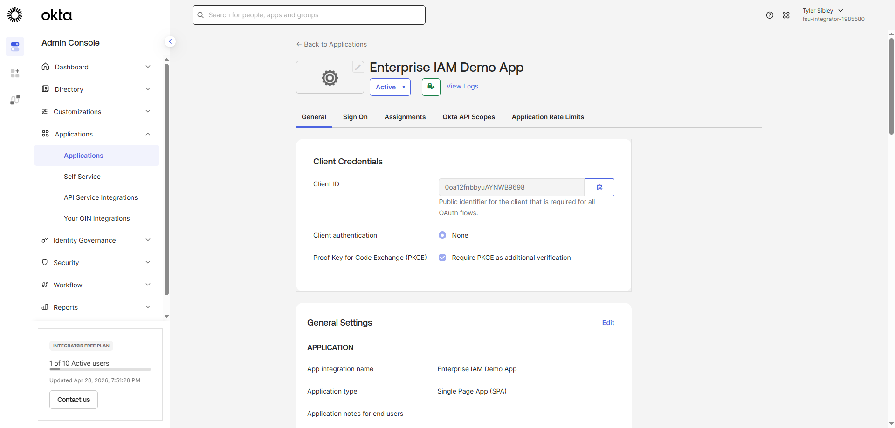
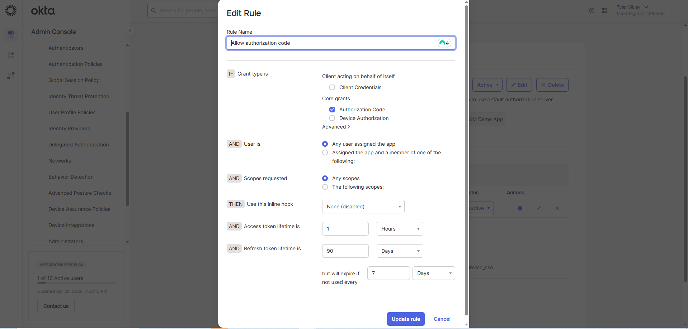
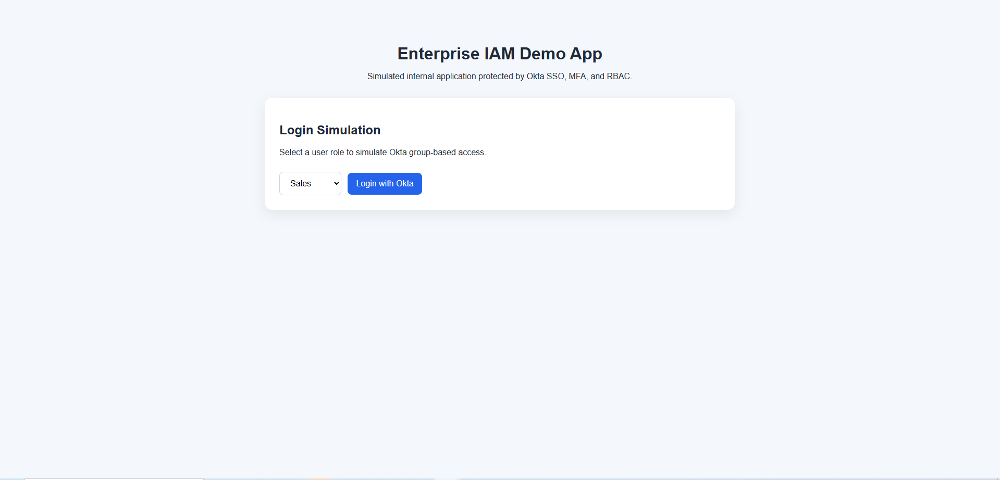
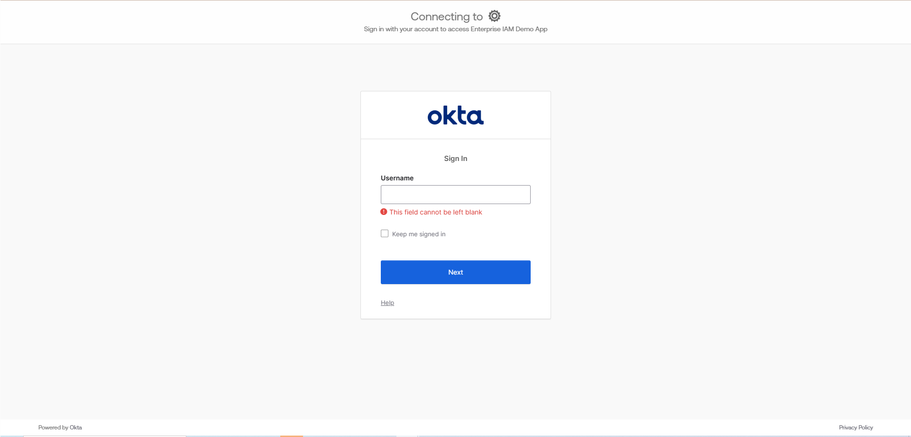
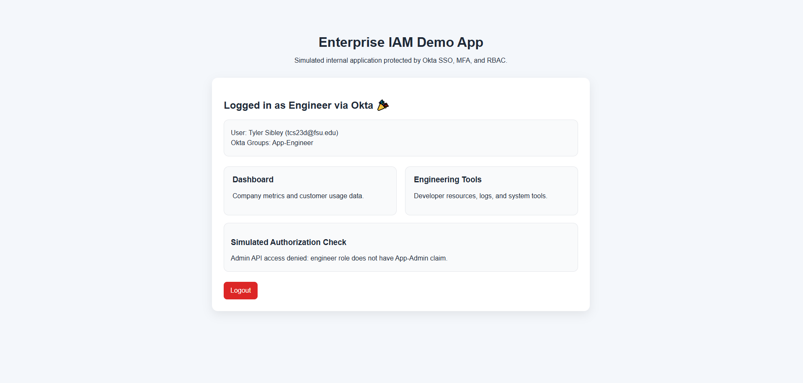
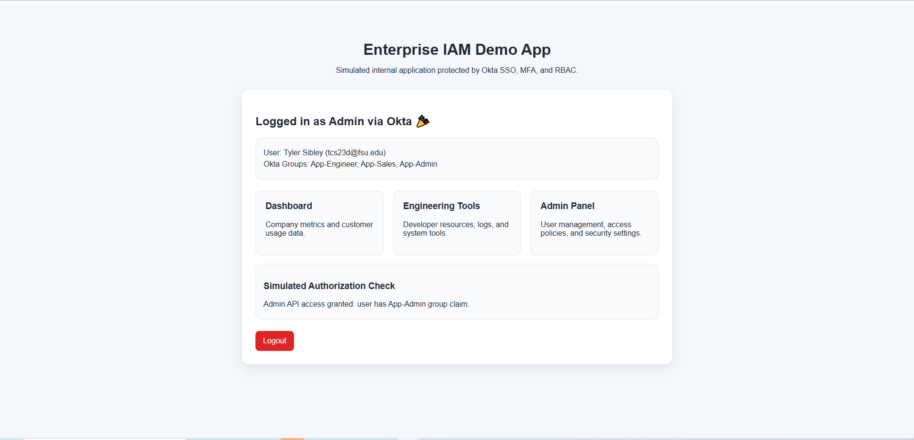
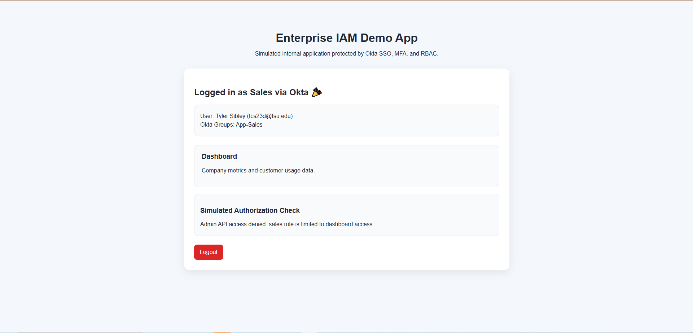
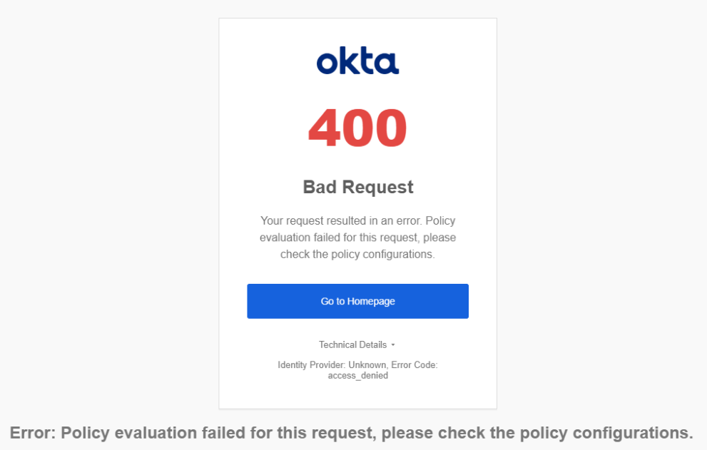
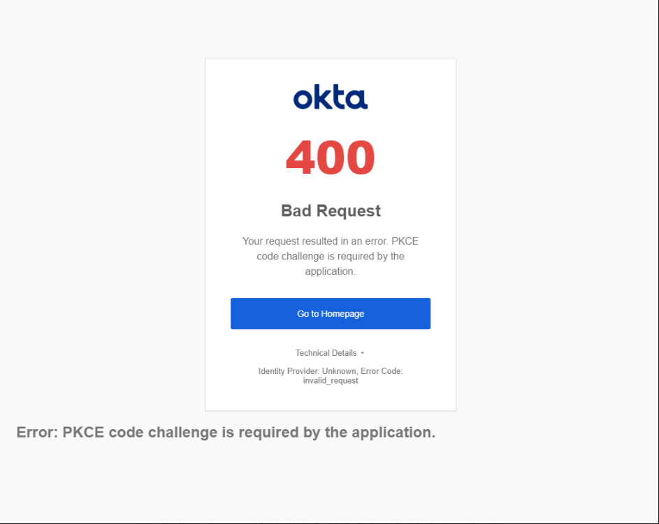

# Enterprise IAM Demo App (Okta OIDC + PKCE)

## Overview

This project demonstrates a real-world Identity and Access Management (IAM) implementation using Okta. It simulates a secure internal application protected by OAuth 2.0, OpenID Connect (OIDC), and PKCE.

Users authenticate through Okta and are redirected back to the application with secure tokens. The app then renders content based on authentication state.

---

🚀 Live Demo: https://tylersibley.github.io/okta-iam-architecture-lab/

---

## Key Features

* 🔐 Okta OAuth 2.0 Authorization Code Flow with PKCE
* 🌐 OpenID Connect (OIDC) authentication
* 🔁 Secure redirect + token exchange
* 🧠 Session-based login handling
* 🚪 Logout with Okta session termination
* 🔐 Role-Based Access Control (RBAC) using Okta group claims

---

## Architecture Flow

1. User clicks **Login with Okta**
2. Redirected to Okta `/authorize` endpoint
3. User authenticates
4. Okta returns **authorization code**
5. App exchanges code for tokens via `/token`
6. UI updates to authenticated state

This implementation demonstrates how identity providers (IdPs) embed authorization data (group membership) directly into ID tokens, enabling frontend applications to enforce role-based access control without additional backend calls.

---

## Architecture Diagram

```mermaid
flowchart LR
    A[👤 User Browser] -->|1. Click Login| B[💻 Frontend App<br/>(Your App)]
    B -->|2. /authorize (PKCE)| C[🔐 Okta Authorization Server]
    
    C -->|3. Login + MFA| A
    C -->|4. Authorization Code| B
    
    B -->|5. POST /token<br/>(code + verifier)| D[🔑 Okta Token Endpoint]
    
    D -->|6. ID Token + Access Token<br/>(includes groups)| B
    
    B -->|7. RBAC Logic| E{Role-Based UI}
    
    E -->|Admin| F[👑 Admin Panel]
    E -->|Engineer| G[🛠 Engineering Tools]
    E -->|Sales| H[📊 Sales Dashboard]
    
    B -->|Optional| I[☁️ AWS Resources]
    I --> J[(S3 / RDS / Console)]

---

## Tech Stack

* Frontend: HTML, CSS, JavaScript
* Identity Provider: Okta
* Protocols: OAuth 2.0, OpenID Connect (OIDC)
* Security: PKCE (Proof Key for Code Exchange)

---

## Screenshots

### 🔧 Okta App Configuration



### 🔐 Authorization Policy Rule



### 🔓 Login Screen



### 🔁 Okta Hosted Login Redirect


### ✅ Successful Authentication

### 🧑‍💻 Engineer RBAC View


### 👑 Admin RBAC View


### 💼 Sales RBAC View


### ⚠️ Debugging Errors (PKCE / Policy)




---

## Lessons Learned

* Configuring OAuth flows requires correct **grant types + PKCE alignment**
* Okta policies must explicitly allow **Authorization Code flow**
* Redirect URIs must match exactly or authentication fails
* Debugging IAM flows involves interpreting multiple error states (PKCE, policy, assignment)

---

## How to Run

1. Clone repo
2. Update `script.js` with your Okta domain + client ID
3. Host with GitHub Pages or local server
4. Click **Login with Okta**

---

## Production Considerations

- Tokens should be validated server-side (JWT signature verification)
- Access tokens should be used for API authorization (not ID tokens)
- Sensitive logic should not rely solely on frontend RBAC
- Secure storage should use HTTP-only cookies instead of sessionStorage
- MFA and conditional access policies can be enforced via Okta policies

---

## Why This Matters

This project replicates how real SaaS apps (like Okta, AWS, Google) handle authentication securely in production environments.
