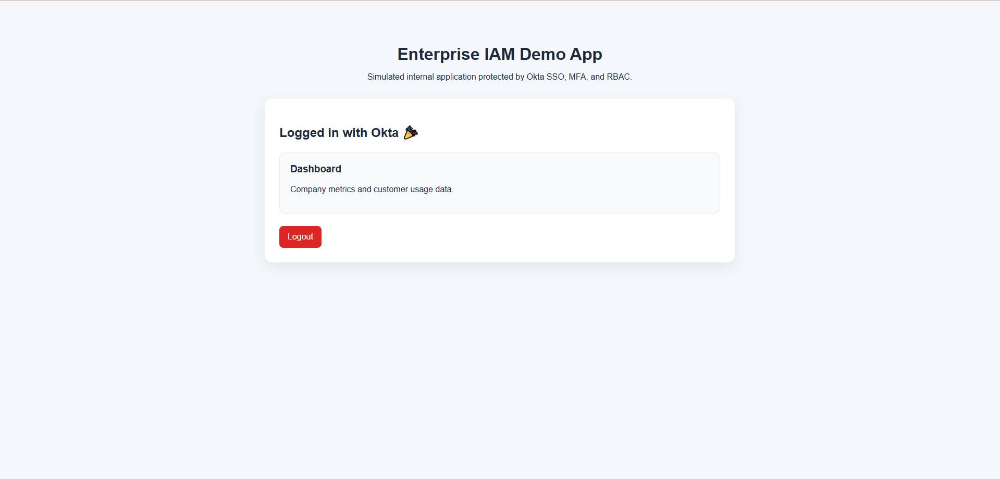
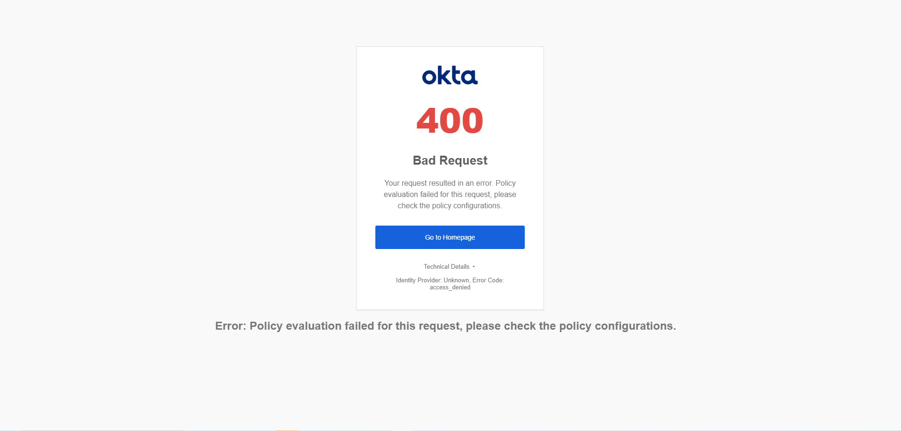

# Enterprise IAM Demo App (Okta OIDC + PKCE)

## Overview

This project demonstrates a real-world Identity and Access Management (IAM) implementation using Okta. It simulates a secure internal application protected by OAuth 2.0, OpenID Connect (OIDC), and PKCE.

Users authenticate through Okta and are redirected back to the application with secure tokens. The app then renders content based on authentication state.

---

## Key Features

* 🔐 Okta OAuth 2.0 Authorization Code Flow with PKCE
* 🌐 OpenID Connect (OIDC) authentication
* 🔁 Secure redirect + token exchange
* 🧠 Session-based login handling
* 🚪 Logout with Okta session termination
* 🏢 Role simulation (Sales, Engineer, Admin UI)

---

## Architecture Flow

1. User clicks **Login with Okta**
2. Redirected to Okta `/authorize` endpoint
3. User authenticates
4. Okta returns **authorization code**
5. App exchanges code for tokens via `/token`
6. UI updates to authenticated state

---

## Tech Stack

* Frontend: HTML, CSS, JavaScript
* Identity Provider: Okta
* Protocols: OAuth 2.0, OpenID Connect (OIDC)
* Security: PKCE (Proof Key for Code Exchange)

---

## Screenshots

### 🔧 Okta App Configuration

### 🔐 Authorization Policy Rule

### 🔓 Login Screen

### 🔁 Okta Hosted Login Redirect

### ✅ Successful Authentication

### ⚠️ Debugging Errors (PKCE / Policy)

---

## Lessons Learned

* Configuring OAuth flows requires correct **grant types + PKCE alignment**
* Okta policies must explicitly allow **Authorization Code flow**
* Redirect URIs must match exactly or authentication fails
* Debugging IAM flows involves interpreting multiple error states (PKCE, policy, assignment)

---

## How to Run

1. Clone repo
2. Update `script.js` with your Okta domain + client ID
3. Host with GitHub Pages or local server
4. Click **Login with Okta**

---

## Why This Matters

This project replicates how real SaaS apps (like Okta, AWS, Google) handle authentication securely in production environments.
