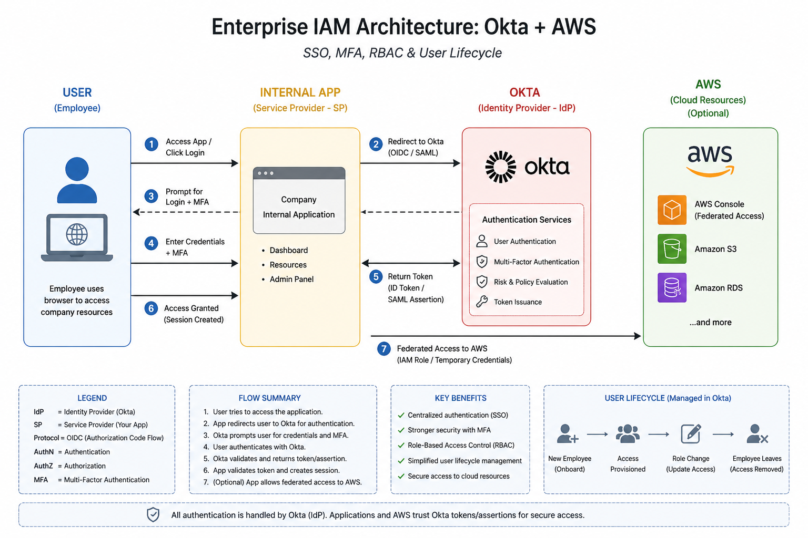
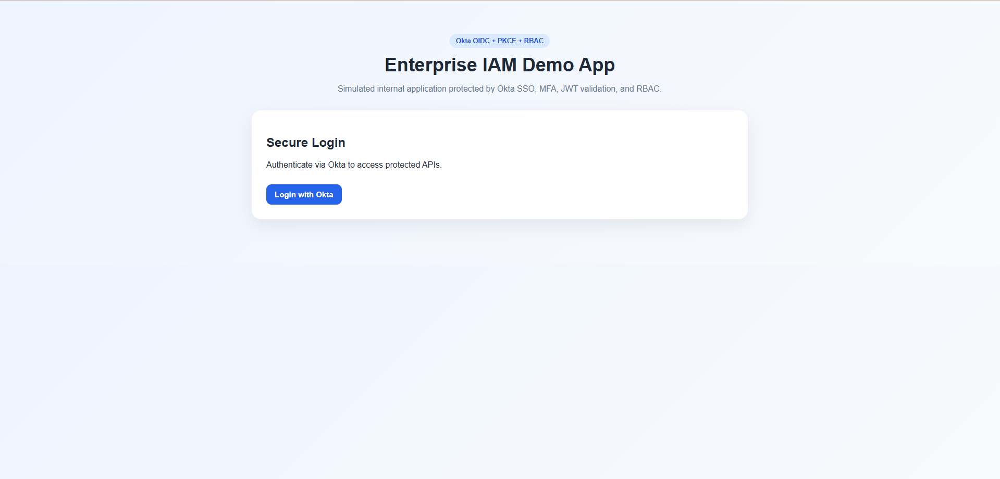
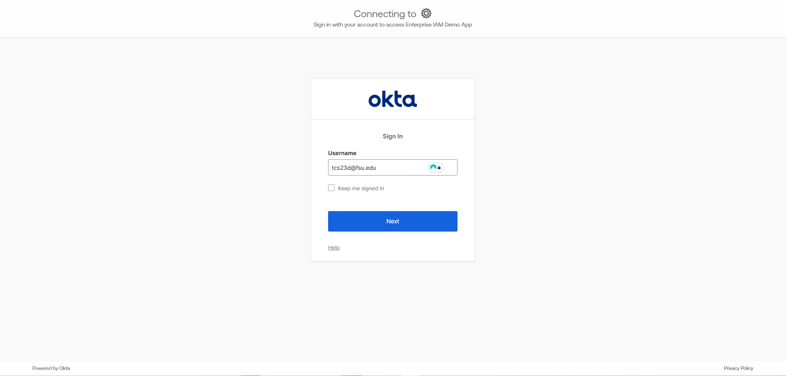
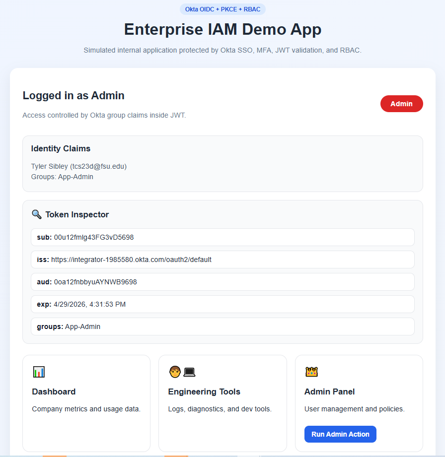
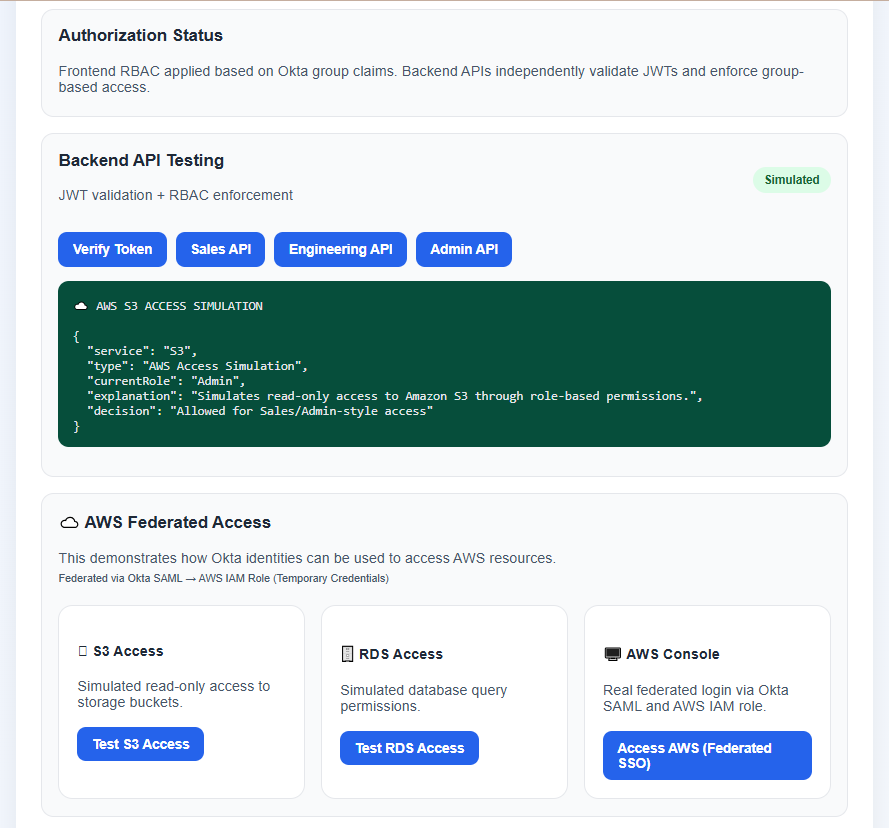
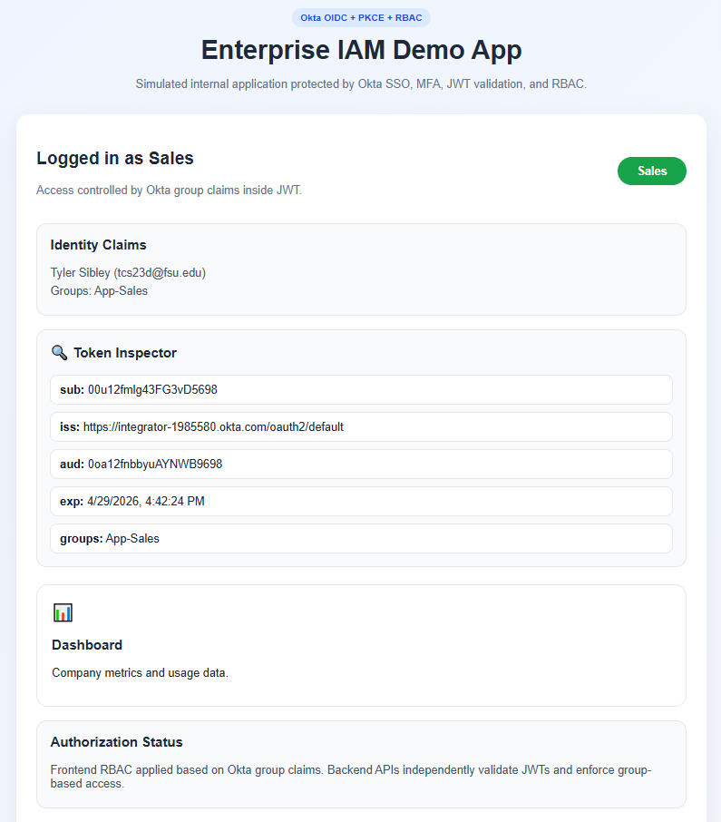
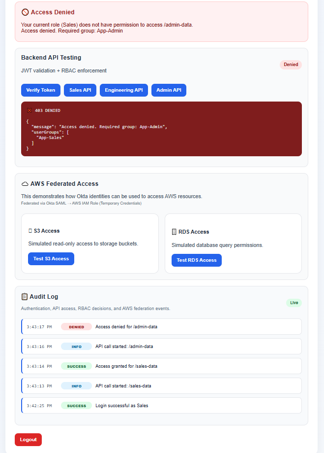
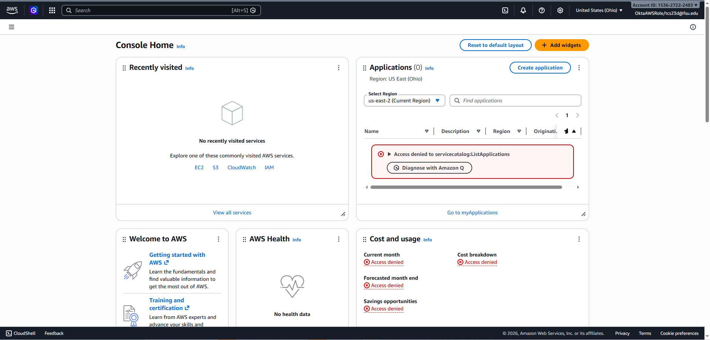
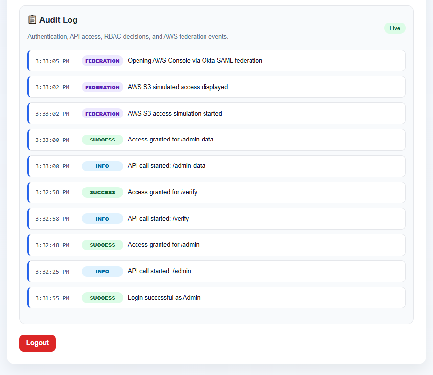

# Enterprise IAM Demo App (Okta + AWS Federation)

## Overview

This project demonstrates a real-world **Identity and Access Management (IAM)** system using Okta as the Identity Provider and AWS for federated access.

It simulates a secure internal enterprise application with:

- 🔐 Single Sign-On (SSO) via Okta (OIDC + PKCE)
- 🧠 Role-Based Access Control (RBAC) using Okta group claims
- 🔒 Backend-style authorization enforcement
- ☁️ Federated access to AWS via SAML + IAM roles
- 📋 Audit logging of authentication and access events

Users authenticate through Okta, receive secure JWTs, and are granted or denied access based on their assigned role.

---

🚀 **Live Demo:**  
https://tylersibley.github.io/okta-iam-architecture-lab/

---

## Architecture Diagram

---

## Key Features

- 🔐 **Okta OIDC Authorization Code Flow with PKCE**
- 👥 **Role-Based Access Control (RBAC)** using Okta groups
- 🧾 **JWT Token Inspection** (claims, expiration, issuer)
- 🧠 **Frontend + Backend RBAC enforcement**
- 🚫 **Access Denied handling for unauthorized users**
- ☁️ **AWS Federation via SAML → IAM Role (temporary credentials)**
- 📋 **Audit Log system (authentication + API + federation events)**

---

## Authentication & Authorization Flow

1. User clicks **Login with Okta**
2. Redirected to Okta `/authorize` endpoint
3. User authenticates (with optional MFA)
4. Okta returns an **authorization code**
5. App exchanges code for **ID + Access tokens**
6. JWT is parsed for **group claims**
7. UI renders based on role (RBAC)
8. APIs enforce access control based on role
9. (Optional) User accesses AWS via **SAML federation**

---

## Role-Based Access Control (RBAC)

| Role        | Access Level                          |
|------------|--------------------------------------|
| Admin      | Full access (Admin + Engineering APIs) |
| Engineering| Engineering APIs only                 |
| Sales      | Sales APIs only                      |

RBAC is enforced in:
- ✅ Frontend (UI visibility)
- ✅ Backend simulation (API authorization responses)

---

## Tech Stack

- **Frontend:** HTML, CSS, JavaScript  
- **Identity Provider:** Okta  
- **Cloud Integration:** AWS (SAML Federation + IAM Role)  
- **Protocols:** OAuth 2.0, OpenID Connect (OIDC), SAML  
- **Security:** PKCE, JWT validation concepts  

---

## Screenshots

---

### 1. 🔓 Login Screen

---

### 2. 🔐 Okta Hosted Login

---

### 3. 👑 Admin Dashboard (Full Access)

---

### 4. ✅ Admin API Access (Allowed)

---

### 5. 💼 Sales User Dashboard (Restricted)

---

### 6. 🚫 Access Denied (RBAC Enforcement)

---

### 7. ☁️ AWS Federation (Assumed Role)

---

### 8. 📋 Audit Log (Authentication + API + Federation)

---

## AWS Federation Flow

- User clicks **Access AWS (Federated SSO)**
- Okta issues a **SAML assertion**
- AWS trusts Okta as Identity Provider
- User assumes an **IAM Role**
- AWS provides **temporary credentials**

This mirrors how enterprises grant secure cloud access without IAM users.

---

## Lessons Learned

- IAM systems combine **authentication + authorization + identity data**
- RBAC should be enforced both in UI and backend systems
- JWTs can carry authorization data (groups/roles)
- OAuth (OIDC) and SAML solve different enterprise use cases
- AWS federation removes need for long-term credentials
- Audit logging is critical for **security visibility and compliance**

---

## How to Run

1. Clone the repo
2. Update `script.js` with:
   - Okta domain
   - Client ID
3. Configure your Okta app (OIDC + PKCE)
4. Host locally or via GitHub Pages
5. Click **Login with Okta**

---

## Production Considerations

- Validate JWT signatures server-side
- Use Access Tokens for API authorization
- Store tokens securely (HTTP-only cookies preferred)
- Enforce RBAC at backend (not just UI)
- Implement MFA + conditional access policies in Okta
- Use least-privilege IAM roles in AWS

---

## Why This Matters

This project replicates how real enterprise systems:

- Authenticate users (SSO)
- Control access (RBAC)
- Integrate with cloud providers (AWS federation)
- Monitor activity (audit logs)

It reflects patterns used by platforms like Okta, AWS, and enterprise SaaS applications.
